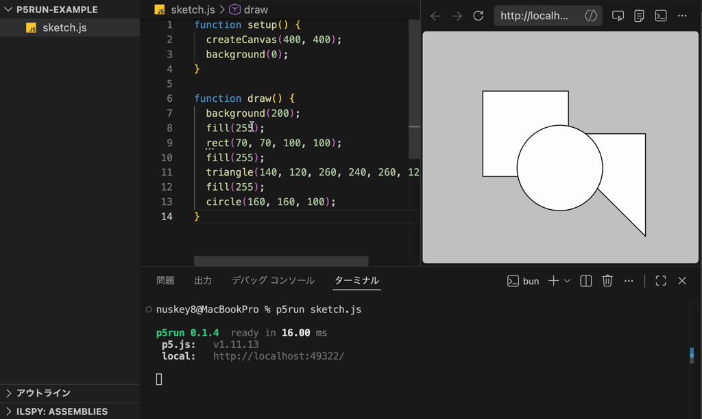

# p5run
A CLI tool for p5.js live coding.

p5run is a CLI tool for running [p5.js](https://p5js.org/) locally. It allows you to start a live server that renders a single JS file directly without the need for an HTML file.



## Features

- Render p5.js with a single JS file
- Supports hot reloading
- Supports TypeScript

## Installation

To use p5run, you need Bun runtime version 1.1.0 or later. You can install it using the following command.

```bash
$ bun install -g p5run
```

## Usage

```bash
$ p5run -h
Usage: p5run [options] <sketch.js|sketch.ts>

Options:
  -p, --port <port>              Port to listen on
      --host <host>              Host to bind
      --p5js-version <version>   p5.js version to load from jsDelivr
  -o, --open                     Open the preview in the default browser
  -h, --help                     Show this help message
```

Static files are served from the same directory as the sketch, so assets can be
loaded with paths such as `loadImage("assets/photo.png")`.

## License

This library is distributed under the [MIT License](LICENSE).
